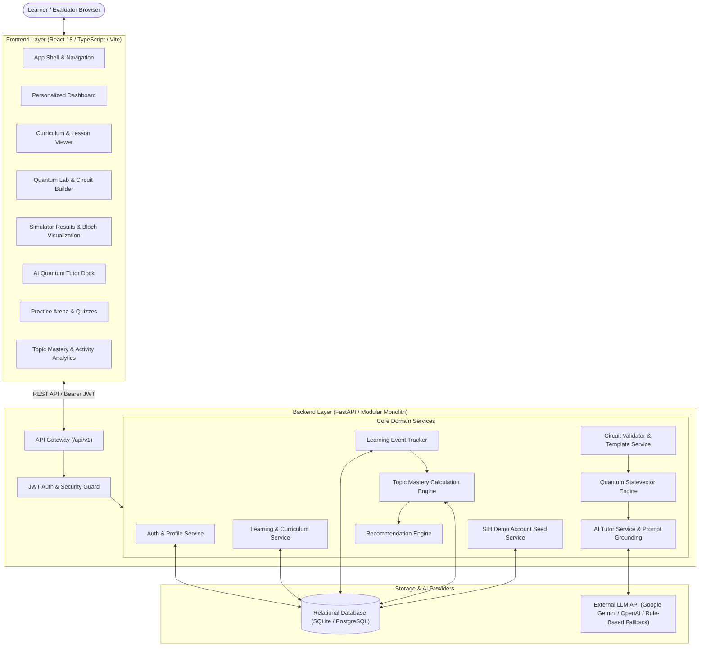

# QUANTUMANIA ⚛️
### AI-Based Interactive Quantum Algorithm Learning Platform
**Smart India Hackathon (SIH 2026)**

[](LICENSE)
[-34d399.svg)](docs/architecture.md)
[-06b6d4.svg)](backend/tests/)
[](frontend/)

---

## 1. Problem Statement
Quantum computing represents the frontier of modern computational science, yet learning quantum algorithms presents steep barriers for students:
1. **Mathematical Abstraction:** Dirac bra-ket notations, Hilbert spaces, and unitary matrices are difficult to grasp without real-time visual feedback.
2. **Disconnected Tools:** Existing software kits (e.g. Qiskit, Cirq) require complex local Python installations with no unified pedagogical interface.
3. **AI Hallucinations:** Generic LLMs often invent non-physical quantum probabilities or misunderstand destructive wave interference.
4. **Lack of Adaptivity:** Traditional platforms treat all students identically rather than adapting to their specific misconceptions.

---

## 2. The QUANTUMANIA Solution
**QUANTUMANIA** is an integrated, browser-based quantum algorithm learning platform that connects theory, circuit experimentation, classical simulation, AI tutoring, and adaptive intelligence into **one unified product**:

- **Visual Quantum Circuit Builder:** Drag-and-drop circuit canvas with real-time gate validation and multi-qubit entanglement support.
- **Classical Statevector Simulator:** High-fidelity $2^n$ statevector matrix math, 1024-shot probabilistic sampling, and 3D Bloch sphere vector calculations.
- **Grounded AI Quantum Tutor:** Context-aware pedagogical AI anchored strictly to verified simulator outputs and lesson concepts, eliminating mathematical hallucination.
- **Adaptive Learner Intelligence:** Explainable 5-factor topic mastery formula across all 20 curriculum topics, identifying weak areas and recommending remediation.
- **Interactive Practice Arena:** Hands-on lab challenges with 1-click launch and instant-feedback concept knowledge checks.
- **Turnkey SIH Demo Experience:** 1-click demo sign-in with pre-seeded learning progress, simulation history, and adaptive recommendations.

---

## 3. Technology Stack

### Frontend
- **Framework:** React 18, TypeScript 5.5, Vite 5.4
- **Routing:** React Router v6
- **Styling:** Custom Vanilla CSS Design System with dark-mode obsidian surface (`--bg-surface`) and high-contrast accents
- **Icons:** Lucide React

### Backend
- **Framework:** FastAPI (Python 3.14)
- **Data Validation:** Pydantic v2
- **ORM & Database:** SQLAlchemy with SQLite (`dev.db`) for local zero-config evaluation; PostgreSQL for production
- **Security:** Bcrypt (12 rounds) + JWT (HS256)

### Quantum Simulation & AI
- **Simulator Backend:** Classical Python matrix tensor math ($H, X, Y, Z, S, T, CNOT, SWAP, Measure$)
- **AI Engine:** Google Gemini (`gemini-1.5-flash`), OpenAI (`gpt-4o-mini`), and deterministic quantum fallback engine

---

## 4. Platform Architecture



---

## 5. Getting Started & Local Development

### Prerequisites
- **Python 3.10+** (tested on Python 3.14)
- **Node.js 18+** and **npm 9+**

### 1. Clone the Repository
```bash
git clone https://github.com/vaibhavmittaldev/QUANTUMANIA.git
cd QUANTUMANIA
```

### 2. Environment Setup
```bash
cp .env.example .env
```
*(The default settings use SQLite and local fallback simulation, allowing instant zero-config startup without external API keys).*

### 3. Backend Setup
```bash
# Install Python dependencies
pip install -r backend/requirements.txt

# Start backend server
python -m uvicorn app.main:app --host 127.0.0.1 --port 8000 --app-dir backend
```
Backend API will be available at: `http://127.0.0.1:8000` (API Docs at `http://127.0.0.1:8000/docs`).

### 4. Frontend Setup
```bash
cd frontend

# Install dependencies
npm install

# Start development server
npm run dev
# Or build and preview production bundle:
npm run build
npm run preview -- --host 127.0.0.1 --port 3000
```
Frontend application will be accessible at: `http://127.0.0.1:3000`.

---

## 6. Official SIH 2026 Demo Evaluator Account
For SIH judges and evaluators, the database seeds an official evaluation account automatically on startup:
- **Email:** `demo@quantumania.org`
- **Password:** `DemoPass123!`
- **1-Click Quick Login:** Navigate to `http://localhost:3000/login` and click **"Quick Demo Sign-In (Evaluator Mode)"**.

---

## 7. Running Tests & Quality Verification

### Run Backend Unit & Integration Tests (73 Tests)
```bash
python -m pytest backend/tests/ -v
```
Output:
```text
======================= 73 passed in 8.88s =======================
```

### Run Frontend TypeScript Typecheck
```bash
cd frontend
npm run typecheck
```
Output:
```text
> tsc --noEmit (0 errors)
```

### Run Frontend Production Build
```bash
cd frontend
npm run build
```
Output:
```text
✓ 1608 modules transformed.
✓ built in 1.40s (104.7 kB gzipped JS, 1.98 kB CSS)
```

---

## 8. Complete Project Structure
```text
quantum-learning-platform/
├── backend/
│   ├── app/
│   │   ├── api/v1/          # Endpoints (auth, learning, quantum, tutor, adaptive)
│   │   ├── core/            # Configuration, security, exceptions
│   │   ├── db/              # SQLAlchemy models (user, learning, adaptive)
│   │   ├── schemas/         # Pydantic validation contracts
│   │   └── services/        # Domain engines (circuit, sim, tutor, adaptive, demo)
│   ├── tests/               # 73 unit and integration tests
│   └── requirements.txt     # Python backend dependencies
├── frontend/
│   ├── src/
│   │   ├── components/      # Design system, layout, app shell, feedback states
│   │   ├── config/          # Navigation and route definitions
│   │   ├── context/         # AuthContext and CircuitContext
│   │   ├── features/
│   │   │   ├── auth/        # Login (with 1-click demo) & Registration
│   │   │   ├── dashboard/   # Unified learner dashboard
│   │   │   ├── learning/    # Courses, modules, and 20 lessons viewer
│   │   │   ├── circuit/     # Quantum Lab, grid, inspector, simulator
│   │   │   ├── practice/    # Practice Arena & knowledge quizzes
│   │   │   └── progress/    # 20-topic mastery matrix & activity timeline
│   │   ├── services/        # Typed API client
│   │   └── types/           # TypeScript domain interfaces
│   ├── package.json         # Scripts: dev, build, typecheck, preview
│   └── vite.config.ts       # Vite bundler config
├── docs/
│   ├── architecture.md      # Detailed system architecture with Mermaid
│   ├── demo-guide.md        # Step-by-step SIH demonstration script
│   └── integration/         # Phase 1 through Phase 7 integration reports
├── .env.example             # Documented environment template
└── README.md                # Project documentation
```

---

## 9. SIH Demonstration Workflow
1. **Login:** Click "Quick Demo Sign-In (Evaluator Mode)".
2. **Dashboard:** Review personalized stats, 3-day streak, and adaptive recommendations.
3. **Curriculum:** Open Lesson 3 (The Superposition Principle) to review Dirac notation.
4. **Quantum Lab:** One-click launch into the circuit canvas with Hadamard gate on qubit 0.
5. **Simulator:** Run 1024 shots to observe exact $|0\rangle: 50\% / |1\rangle: 50\%$ distribution and Bloch sphere.
6. **AI Tutor:** Ask *"Explain what happened in this circuit"* $\to$ receive grounded pedagogical explanation.
7. **Practice Arena:** Visit `/app/practice` $\to$ solve a concept quiz $\to$ earn XP.
8. **Progress Analytics:** Visit `/app/progress` $\to$ inspect live Topic Mastery matrix updated across all 20 topics!

---

## 10. Future Scope
- Integration with IBM Quantum and AWS Braket for physical QPU execution.
- Multi-qubit density matrix open-system noise simulation.
- Collaborative real-time quantum algorithm pair-programming rooms.
