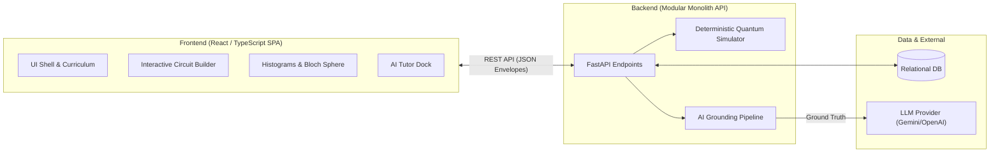

# QUANTUMANIA ⚛️
### AI-Based Interactive Quantum Algorithm Learning Platform
**Smart India Hackathon (SIH 2026)**

[](LICENSE)
[](docs/DEVELOPMENT_ROADMAP.md)

---

## 1. Problem Statement

Quantum computing represents the frontier of computational science, yet learning quantum mechanics principles and algorithm design presents immense barriers for students:
1. **Mathematical Abstraction**: Complex linear algebra, Dirac notation, and Hilbert spaces are intimidating without visual intuition.
2. **Disconnected Tools**: Existing open-source SDKs (e.g. Qiskit, Cirq) require heavy local Python environments and lack intuitive real-time drag-and-drop circuit visualization.
3. **AI Hallucinations**: Standard LLMs attempt to predict quantum outcomes without running mathematical simulations, producing hallucinated statevectors and incorrect phase physics.

---

## 2. The QUANTUMANIA Solution

**QUANTUMANIA** is an interactive, browser-based quantum learning platform that pairs visual circuit construction with deterministic mathematical simulation, 3D Bloch sphere projections, and a grounded AI Tutor.

* **Drag-and-Drop Circuit Builder**: Build multi-qubit quantum circuits with instant client validation.
* **Deterministic Simulation Engine**: High-fidelity local statevector calculation and shot measurement sampling.
* **Rich Quantum Visualizations**: Real-time statevector amplitude tables, probability histograms, and Bloch spheres.
* **Grounded Socratic AI Tutor**: An AI assistant anchored strictly to verified simulation outputs to explain quantum phenomena without hallucinating math.
* **Progressive Curriculum & Challenges**: Structured courses, conceptual quizzes, and automated algorithmic challenge grading.

---

## 3. High-Level Architecture

QUANTUMANIA is architected as a clean modular system:



---

## 4. Technology Stack

- **Frontend**: React, TypeScript, HTML5 Canvas / SVG, Vanilla CSS tokens (see [UI System](docs/UI_SYSTEM.md)).
- **Backend**: Python 3.11+, FastAPI, Pydantic v2 (strict validation), NumPy / SciPy (quantum linear algebra).
- **Database**: PostgreSQL (Production) / SQLite (Zero-config local development).
- **AI Tutoring**: Google Gemini / OpenAI via server-side grounded context builder.
- **Specification Standards**: JSON Schema 2020-12, OpenAPI 3.0.

---

## 5. Repository Structure

```
quantum-learning-platform/
├── frontend/                     # Frontend client workspace (Phase 1-6)
│   └── README.md                 # Scaffold guide & module breakdown
├── backend/                      # Backend API & domain services (Phase 1-6)
│   └── README.md                 # Scaffold guide & module breakdown
├── docs/                         # Canonical specifications & architectural contracts
│   ├── PRD.md                    # Product requirements & complete user journey
│   ├── ARCHITECTURE.md           # System architecture, services & data flows
│   ├── QUANTUM_SCHEMA.md         # Canonical circuit JSON & simulation result contract
│   ├── API_CONTRACT.md           # Unified REST API endpoints & response envelopes
│   ├── DATABASE.md               # 16 MVP relational entities, fields & relationships
│   ├── AI_ARCHITECTURE.md        # AI grounding pipeline & Socratic prompt design
│   ├── UI_SYSTEM.md              # Dark mode design tokens, typography & components
│   ├── DEVELOPMENT_ROADMAP.md    # 8-phase roadmap, timeline & dependencies
│   ├── TEAM_OWNERSHIP.md         # Developer ownership matrix & collaboration rules
│   └── INTEGRATION_GUIDE.md      # Integration checklists & cross-developer mocks
├── .github/
│   ├── pull_request_template.md  # Standardized PR template with contract change checks
│   └── ISSUE_TEMPLATE/           # Templates for features, bugs, architecture & docs
├── .gitignore                    # Environment, build, and secret exclusions
├── .env.example                  # Environment configuration template
└── README.md                     # Project overview and developer onboarding
```

---

## 6. Team Ownership & Responsibilities

The project is developed by a two-person team with strict modular boundaries to avoid merge conflicts:

| Developer | Role | Owned Phases & Subsystems |
| :--- | :--- | :--- |
| **Vaibhav** | Lead / Architecture & Core Platform | **Phase 0** (Foundation), **Phase 1** (Auth & Shell), **Phase 2** (Curriculum), **Phase 6** (Assessment & Progress), **Phase 7** (Integration) |
| **Tanishq** | Lead / Quantum & AI Systems | **Phase 3** (Circuit Builder), **Phase 4** (Simulator & Visualizer), **Phase 5** (AI Tutor Engine) |

For complete governance and change request rules, see [docs/TEAM_OWNERSHIP.md](docs/TEAM_OWNERSHIP.md).

---

## 7. Canonical Contracts (Single Source of Truth)

All developers and modules must adhere to the shared specifications established in Phase 0:

- **Circuit & Simulation Contract**: [docs/QUANTUM_SCHEMA.md](docs/QUANTUM_SCHEMA.md)
  - Defines the single canonical representation for circuits ($X, Y, Z, H, CNOT, MEASURE$) and simulation outputs (`counts`, `statevector`, `probabilities`, `bloch_vectors`).
- **REST API Contract**: [docs/API_CONTRACT.md](docs/API_CONTRACT.md)
  - Unified success `{ success: true, data: { ... } }` and error `{ success: false, error: { ... } }` envelopes.
- **Relational Database Schema**: [docs/DATABASE.md](docs/DATABASE.md)
  - 16 core entities with normalized foreign keys and constraints.

---

## 8. Local Setup & Getting Started

### 8.1. Prerequisites
- Git
- Python 3.11+
- Node.js 18+ & npm

### 8.2. Environment Configuration
Copy the configuration template:
```bash
cp .env.example .env
```
Update `.env` with your preferred local database URL and API keys.

---

## 9. Git Workflow & Collaboration Rules

1. **Branch Naming**:
   - Vaibhav: `feature/vaibhav/<phase-number>-<feature-name>`
   - Tanishq: `feature/tanishq/<phase-number>-<feature-name>`
2. **Pull Requests**:
   - Always fill out `.github/pull_request_template.md`.
   - Any PR modifying shared contracts (`docs/*`) requires dual approval from both Vaibhav and Tanishq.

---

## 10. Development Roadmap

- [x] **Phase 0 — Foundation & Shared Contracts** (Vaibhav)
- [ ] **Phase 1 — Authentication + Application Shell** (Vaibhav)
- [ ] **Phase 2 — Learning + Curriculum Engine** (Vaibhav)
- [ ] **Phase 3 — Quantum Circuit Builder Canvas** (Tanishq)
- [ ] **Phase 4 — Quantum Simulator + Visualizations** (Tanishq)
- [ ] **Phase 5 — Grounded AI Tutor** (Tanishq)
- [ ] **Phase 6 — Assessment + Progress Analytics** (Vaibhav)
- [ ] **Phase 7 — End-to-End Integration & MVP Hardening** (Vaibhav)

See [docs/DEVELOPMENT_ROADMAP.md](docs/DEVELOPMENT_ROADMAP.md) for full milestone details.
