# Grounded AI Tutor Architecture

## 1. Core Mission & Inviolable Architectural Law

The AI Tutor in **QUANTUMANIA** is an intelligent pedagogical assistant designed to accelerate comprehension of abstract quantum mechanics principles (superposition, interference, entanglement, phase) and algorithm designs.

> ### THE INVIOLABLE LAW OF QUANTUM AI GROUNDING:
> **The AI Model MUST NEVER act as the quantum simulation engine.**
>
> Large Language Models (LLMs) are statistical text predictors, not linear algebra matrix simulators. An LLM cannot reliably compute unitary matrix multiplications, statevector normalization, or phase kickbacks without hallucinating.
>
> - **WRONG (Forbidden Architecture)**:  
>   `Circuit JSON` $\rightarrow$ `LLM Prompt` $\rightarrow$ `LLM hallucinations statevector / counts`
>
> - **CORRECT (QUANTUMANIA Architecture)**:  
>   `Circuit JSON` $\rightarrow$ `Deterministic Quantum Simulator` $\rightarrow$ `Verified Mathematical Result` $\rightarrow$ `Context Builder` $\rightarrow$ `LLM Explanation`

---

## 2. AI Tutor Pipeline Diagram

```mermaid
sequenceDiagram
    autonumber
    actor Learner as Student (Browser)
    participant UI as AI Tutor Dock (Frontend)
    participant API as AI Endpoint (/api/v1/ai/explain)
    participant Sim as Deterministic Simulator
    participant Ctx as Context Builder
    participant LLM as External LLM (Gemini / OpenAI)

    Learner->>UI: "Why did my circuit produce 00 and 11 half the time?"
    UI->>API: POST /ai/explain { query, circuit, lesson_id }
    
    rect rgb(20, 30, 45)
        Note over API,Sim: Step 1: Authoritative Math Simulation
        API->>Sim: Run Simulation(circuit, shots=1024)
        Sim-->>API: Verified SimulationResult (counts, statevector)
    end
    
    rect rgb(30, 40, 30)
        Note over API,Ctx: Step 2: Assemble Grounded Context
        API->>Ctx: BuildPrompt(user_query, lesson_meta, circuit, verified_sim)
        Ctx-->>API: Structured Grounded System + User Prompt
    end
    
    rect rgb(40, 30, 50)
        Note over API,LLM: Step 3: LLM Inference with Math Grounding
        API->>LLM: GenerateCompletion(prompt)
        LLM-->>API: Pedagogical explanation
    end
    
    API-->>UI: { success: true, data: { explanation, followups } }
    UI-->>Learner: Display interactive formatted explanation
```



---

## 3. Subsystem Breakdown (Owner: Tanishq - Phase 5)

### 3.1. Context Builder (`backend/app/services/ai_tutor/context_builder.py`)
Responsible for gathering all relevant state before making any call to the model:
1. **User Profile & Level**: Retrieves the learner's experience level (`beginner`, `intermediate`, `advanced`) to tailor vocabulary.
2. **Curriculum Anchor**: Fetches the active lesson title, conceptual objectives, and prerequisites.
3. **Canonical Circuit**: Normalizes the active circuit from `docs/QUANTUM_SCHEMA.md`.
4. **Verified Simulation**: Injects the authoritative statevector, probabilities, and measurement counts computed by the simulator.
5. **Conversation History**: Injects the last 3-4 dialogue turns for conversational coherence.

### 3.2. Socratic Prompt Engineering
The system prompt enforces a supportive, pedagogical tone:
- Encourage active discovery rather than spoon-feeding direct answers to challenges.
- Use intuitive physical analogies (e.g. coin flips for superposition, coupled pendulums for entanglement) appropriate for the user's level.
- Reference exact circuit gates ($H$, $CNOT$) and basis states ($|00\rangle, |11\rangle$) matching the learner's canvas.

---

## 4. Context Assembly Template

```markdown
You are QUANTUMANIA's AI Tutor, an expert quantum computing educator.
Your role is to guide the student using Socratic questioning, clear physical intuition, and rigorous mathematical clarity.

### MANDATORY RULES:
1. Ground all your statements strictly in the VERIFIED SIMULATION DATA provided below.
2. Never contradict the verified simulator output.
3. If the user asks for a challenge answer, provide an intuitive hint or diagnostic question instead of giving the complete solution immediately.
4. Keep answers concise, visually formatted with LaTeX/Markdown, and encourage the learner to experiment on the circuit canvas.

### CURRENT LEARNER CONTEXT:
- Experience Level: {{ user.experience_level }}
- Current Lesson: "{{ lesson.title }}"
- Lesson Concept Goal: {{ lesson.concept_goal }}

### CURRENT CIRCUIT CONFIGURATION:
- Number of Qubits: {{ circuit.qubits }}
- Gates Applied: {{ circuit.gates_summary }}

### VERIFIED SIMULATOR OUTPUT (GROUND TRUTH):
- Measurement Shots: {{ simulation.shots }}
- Measurement Counts: {{ simulation.counts }}
- Exact Statevector: {{ simulation.statevector }}
- Probabilities: {{ simulation.probabilities }}

### STUDENT QUESTION:
"{{ user.query }}"
```

---

## 5. Specialized AI Capabilities

| Capability | Endpoint | Input | Objective |
| :--- | :--- | :--- | :--- |
| **Circuit Explainer** | `POST /ai/explain` | Circuit + SimResult + Query | Explain quantum mechanics behind observed circuit output. |
| **Circuit Debugger** | `POST /ai/debug` | Circuit + SimResult + Expected | Diagnose why a circuit is not producing the expected statevector or probabilities. |
| **Challenge Hinter** | `POST /ai/hint` | Challenge ID + Circuit + HintLevel | Provide a progressive 3-tiered hint without revealing the entire answer. |
| **Code Exporter** | `POST /ai/generate-code` | Canonical Circuit | Translate circuit into reproducible Qiskit or Cirq Python scripts. |

---

## 6. Reliability, Latency & Cost Controls

1. **Deterministic Caching**: If the identical circuit and simulation result has an existing explanation cached, return immediately without re-invoking the LLM.
2. **Context Budgeting**: Keep total prompt length under 2,000 tokens by compacting zero-amplitude statevector entries (only supply basis states with $|a|^2 > 0.001$).
3. **Graceful Fallback**: If the external AI API is unreachable or times out (5000 ms), the backend returns a fallback diagnostic summary generated from standard simulator inspection rules.
