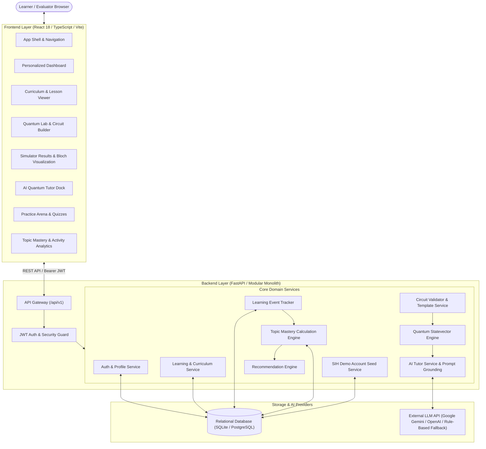
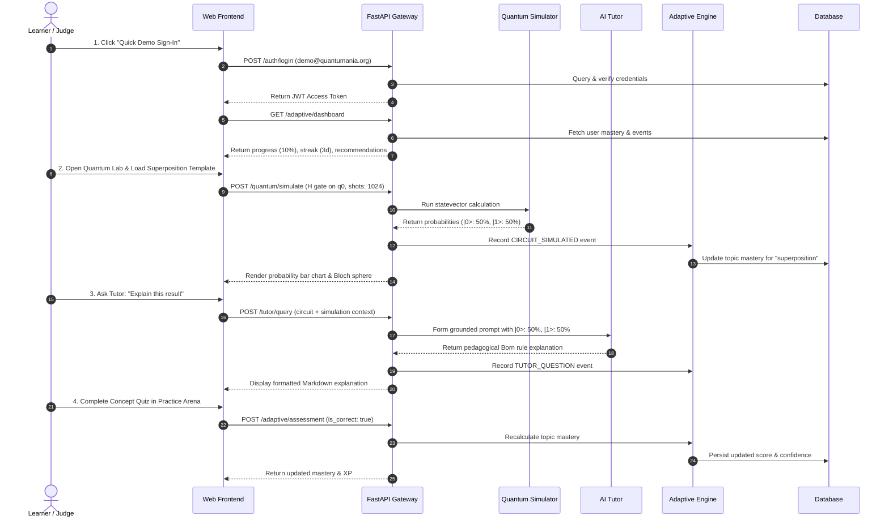

# QUANTUMANIA — Complete System Architecture Specification

## 1. Executive Summary
**QUANTUMANIA** is an AI-based interactive quantum algorithm learning platform created for the Smart India Hackathon (SIH 2026). Its mission is to transform abstract quantum mechanics into intuitive, hands-on understanding by integrating:
1. **Interactive Curriculum:** 20 structured lessons across 5 comprehensive modules.
2. **Visual Circuit Builder:** High-performance, constraint-validated drag-and-drop workspace.
3. **Quantum Simulator:** Classical statevector mathematical simulation with 1024-shot sampling and Bloch sphere vector extraction.
4. **AI Quantum Tutor:** Grounded pedagogical assistant preventing hallucination and explaining quantum states directly.
5. **Adaptive Learner Intelligence:** Explainable topic mastery engine driving personalized remediation and recommendations.
6. **Practice Arena & Analytics:** Hands-on lab challenges and instant conceptual skill checks.

---

## 2. High-Level System Architecture Diagram

---

## 3. Subsystem Breakdown

### 3.1. Frontend Architecture
- **Framework:** React 18, TypeScript 5.5, Vite 5.4.
- **Styling:** Custom Vanilla CSS Design System with dark-mode obsidian surface (`--bg-surface`), neon cyan accents (`--accent-cyan`), emerald (`--accent-emerald`), and purple (`--accent-purple`). Zero runtime CSS-in-JS overhead.
- **State Management:**
  - `AuthContext`: Manages current user session, token storage, and login/logout state.
  - `CircuitContext`: Manages active circuit canvas, gate positioning, undo/redo history stack, and validation status.
- **Key Modules:**
  - `/app/dashboard`: Aggregated metrics, streak, next recommended action, weak area warnings.
  - `/app/learn`: Interactive curriculum navigation, math formulas, and lesson progress.
  - `/app/quantum-lab`: Interactive gate palette, timeline grid, statevector probability charts, and measurement histograms.
  - `/app/practice`: Curated algorithm challenges with 1-click lab launching and instant-feedback concept quizzes.
  - `/app/progress`: 20-topic mastery matrix, level badges, and chronological learning activity timeline.

### 3.2. Backend Architecture
- **Framework:** FastAPI (Python 3.14).
- **Architecture Pattern:** Clean modular monolith with decoupled service boundaries and dependency injection.
- **Persistence:** SQLAlchemy ORM with SQLite for zero-config local evaluation (`dev.db`) and PostgreSQL for production deployments.
- **Security:** Bcrypt password hashing (12 rounds) and signed HMAC-SHA256 JWT tokens with automatic expiry.

### 3.3. Quantum Simulation Engine
- **Representation:** Statevector representation of $2^n$ complex probability amplitudes for up to $n=8$ qubits.
- **Matrix Operators:**
  - Single-qubit unitaries: Hadamard ($H$), Pauli ($X, Y, Z$), Phase ($S, T$).
  - Multi-qubit unitaries: Controlled-NOT ($CNOT$) with arbitrary control and target qubit indices, $SWAP$.
- **Tensor Product Pipeline:** Computes Kronecker products $U = U_1 \otimes U_2 \otimes \dots \otimes U_n$ to construct full operator matrices.
- **Measurement Engine:** Deterministic probability calculation $|\alpha_i|^2$ and pseudo-random sampling across configurable shot counts (default 1024).
- **Geometric Visualization:** Extracts single-qubit reduced density matrix expectation values $\langle \sigma_x \rangle, \langle \sigma_y \rangle, \langle \sigma_z \rangle$ for 3D Bloch sphere projections.

### 3.4. AI Quantum Tutor
- **Pedagogical Anchoring:** Grounded strictly in the learner's active circuit gates, exact statevector probabilities, and lesson context.
- **Hallucination Prevention:** The prompt builder embeds the verified simulator results. If a circuit hasn't been simulated or is stale, the tutor explicitly alerts the user rather than guessing outcomes.
- **Multi-Provider Resilience:** Supports Google Gemini (`gemini-1.5-flash`), OpenAI (`gpt-4o-mini`), and a deterministic rule-based quantum fallback engine that guarantees uninterrupted tutoring even without internet connectivity or API keys.

### 3.5. Adaptive Intelligence & Mastery Engine
- **Event Pipeline:** Unified event tracking across lessons, quizzes, simulations, and tutor questions.
- **Explainable Mastery Formula:**
  $$\text{Mastery} = 0.40 \times \text{Assessment} + 0.25 \times \text{Lesson} + 0.15 \times \text{Circuit} + 0.10 \times \text{Practice} + 0.10 \times \text{Recency}$$
- **Mastery Levels:**
  - Strong: $85 - 100\%$
  - Proficient: $70 - 84\%$
  - Developing: $50 - 69\%$
  - Beginning: $25 - 49\%$
  - Not Started: $0 - 24\%$
- **Prerequisite-Aware Recommendations:** Automatically analyzes unmet prerequisites, detected weak areas, and active curriculum modules to suggest targeted next actions.

---

## 4. End-to-End Data Flow

---

## 5. Security & Isolation Matrix
| Subsystem | Security Mechanism | Validation |
| :--- | :--- | :--- |
| **Authentication** | Passlib bcrypt (12 rounds) + JWT (HS256) | Strict password complexity $\ge 8$ chars |
| **Route Authorization** | `get_current_user` FastAPI dependency | Unauthenticated requests receive HTTP 401 |
| **Data Isolation** | Foreign key filtering (`user_id == current_user.id`) | Users cannot read or modify other users' progress |
| **Circuit Validation** | Pydantic schema validation | Max 8 qubits, depth $\le 100$, no gate collisions |
| **AI Prompt Injection** | Structured JSON context embedding | User prompt isolated in delimited message block |
| **Secrets Protection** | `.env` variables excluded from git | Zero credentials in client bundles or public repositories |
