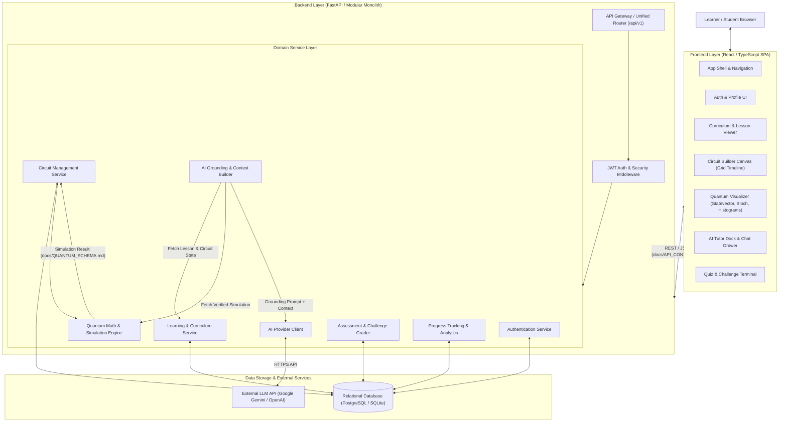

# System Architecture Specification

## 1. Overview

**QUANTUMANIA** is an AI-based interactive quantum algorithm learning platform designed for the Smart India Hackathon (SIH 2026). Its objective is to bridge the gap between theoretical quantum mechanics and practical algorithm design through visual circuit construction, mathematical statevector simulation, interactive Bloch sphere visualizations, grounded AI tutoring, and progressive assessments.

This document describes the high-level architecture, module boundaries, data flows, and subsystem responsibilities.

---

## 2. High-Level Architecture Diagram

---

## 3. Subsystem Responsibilities

### 3.1. Frontend Layer
* **Role**: Client-side single page application running in the learner's browser.
* **Responsibilities**:
  - Render an intuitive, responsive, and aesthetic dark-mode interface (see `docs/UI_SYSTEM.md`).
  - Provide interactive drag-and-drop circuit composition with immediate local validation.
  - Render interactive visualizations:
    - Probability distribution histograms.
    - Qubit statevector representations (amplitudes, phases, probabilities).
    - 3D/2D Bloch sphere coordinates for single-qubit states.
  - Present curriculum content (markdown, math formulas, step-by-step interactive slides).
  - Provide an accessible AI chat dock accessible on any lesson or circuit sandbox.
  - Present quizzes, multiple-choice questions, and automated quantum challenge objectives.
  - Store JWT session tokens in browser memory / secure storage.
* **Non-Responsibilities**:
  - Does NOT calculate arbitrary quantum statevectors or simulate multi-qubit unitary matrices client-side without authoritative backend validation.
  - Does NOT directly invoke external LLM APIs (never expose API keys on client).

### 3.2. Backend API Layer (Modular Monolith)
* **Role**: Central coordinator and business logic host.
* **Architectural Choice**: **Modular Monolith**. 
  - To prevent deployment overhead and latency during SIH development, the backend is packaged as a unified modular service with strictly separated internal domains rather than distributed microservices.
* **Responsibilities**:
  - Route incoming HTTP requests, enforce CORS, validate payloads against schemas.
  - Verify and issue JWT authentication tokens.
  - Coordinate persistence with the database layer.
  - Expose standardized JSON responses (`docs/API_CONTRACT.md`).
  - Orchestrate simulation execution and AI context composition.

### 3.3. Quantum Engine (Simulator Subsystem)
* **Role**: Deterministic mathematical execution engine for quantum circuits.
* **Responsibilities**:
  - Parse and validate canonical circuit schemas (`docs/QUANTUM_SCHEMA.md`).
  - Construct statevector arrays initialized to $|0\dots0\rangle$.
  - Apply standard unitary quantum operators ($X, Y, Z, H, CNOT$).
  - Calculate exact statevector amplitudes, complex phases, and measurement probabilities.
  - Perform simulated projective measurements over $N$ shots (e.g., 1024 shots) using pseudo-random sampling.
  - Return normalized simulation payloads matching `docs/QUANTUM_SCHEMA.md`.
* **Guarantees**:
  - Deterministic execution of pure quantum states.
  - Enforces resource limits: max 10 qubits for the MVP to maintain sub-second response times.

### 3.4. AI Grounding & Tutoring Subsystem
* **Role**: Pedagogical assistant providing contextual explanations, debugging hints, and conceptual clarity.
* **Fundamental Design Law**:
  > **The AI MUST NOT be the quantum simulation engine.**
  > The AI is an explainer and tutor, not a computational simulator. All simulation results fed to the AI must come directly from the verified Quantum Engine output.
* **Responsibilities**:
  - Context Builder: Gather active lesson ID, canonical circuit JSON, verified simulation output, user learner level, and past dialogue turns.
  - System Prompting: Instruct LLM to act strictly as a Socratic quantum physics educator.
  - Generate guided hints rather than simply giving away challenge solutions.
  - Guard against hallucination by anchoring discussions to the mathematical outputs provided in the context.

### 3.5. Database & Persistence Layer
* **Role**: Structured storage of user profiles, learning material, user-saved circuits, attempts, and progress records.
* **Responsibilities**:
  - Relational integrity, foreign key cascades, and indexing (see `docs/DATABASE.md`).
  - Fast read access for curriculum lessons and course trees.
  - Audit trail of quiz submissions and challenge completions for progress tracking.

---

## 4. Primary Data Flows

### 4.1. Circuit Simulation Flow
1. Learner designs circuit on the frontend canvas.
2. Frontend serializes circuit to Canonical Circuit JSON (`docs/QUANTUM_SCHEMA.md`).
3. Frontend issues `POST /api/v1/simulate` with circuit JSON and shot count.
4. Backend `QuantumService` receives request and delegates to `SimulatorEngine`.
5. `SimulatorEngine` validates circuit integrity, calculates statevector, and samples shots.
6. Backend returns normalized `SimulationResult` payload.
7. Frontend Visualizer renders histograms, statevector table, and Bloch sphere angles.

### 4.2. Grounded AI Tutoring Flow
1. Learner asks: *"Why is my measurement output 50% 00 and 50% 11?"*
2. Frontend submits user query along with the current circuit ID and optional client context.
3. Backend `ContextBuilder`:
   - Retrieves canonical circuit representation.
   - Retrieves verified simulation counts and probabilities from cache or simulator.
   - Retrieves active lesson title and concept goals.
   - Retrieves user skill level from profile.
4. `ContextBuilder` crafts a structured prompt:
   - System persona: Socratic Quantum Tutor.
   - Ground truth: Circuit + Verified Simulator counts.
   - User query.
5. Backend calls LLM provider API securely using server-side credentials.
6. LLM response is returned to frontend and rendered in the tutor chat window.

### 4.3. Challenge Evaluation Flow
1. Learner tackles a challenge (e.g. *"Create a Bell State $|\Phi^+\rangle = \frac{|00\rangle + |11\rangle}{\sqrt{2}}$"*).
2. Learner constructs circuit and clicks "Submit Challenge".
3. Backend retrieves target statevector/probabilities for challenge ID.
4. Backend executes learner's circuit on `SimulatorEngine`.
5. Backend compares output statevector fidelity or measurement distribution against target criteria with a defined tolerance threshold ($\epsilon \le 10^{-4}$).
6. If matched, backend marks challenge completed in `Submission` & updates `LessonProgress`.
7. Success response returned with score and unlock recommendations.

---

## 5. Security & Reliability Principles

1. **No Client-Side Secrets**: External AI keys, database credentials, and JWT signing keys are strictly confined to the backend environment (`.env`).
2. **Deterministic Quantum Validation**: All circuit inputs undergo schema validation (target qubit index within qubit range, controls distinct from targets, valid gate names) before reaching the linear algebra simulator.
3. **Graceful Degradation**: If the external AI service experiences downtime or latency, circuit simulation, curriculum reading, and automated grading continue operating without interruption.
4. **State Machine Integrity**: User progress updates are idempotent and protected by atomic transactions.
