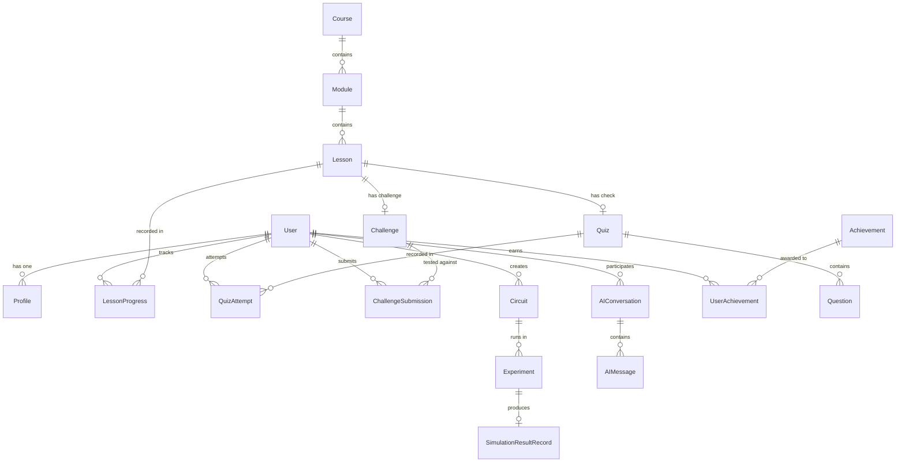

# Database Schema Design Specification

## 1. Overview & Storage Strategy

**QUANTUMANIA** utilizes a relational database model (PostgreSQL in staging/production, SQLite supported in zero-config local development). All entity tables use UUID string primary keys or auto-incrementing integers, with strict foreign key constraints and `created_at` / `updated_at` timestamps.

---

## 2. Entity-Relationship Diagram

---

## 3. Entity Specifications

### 3.1. Identity & Profile

#### `users`
* **Purpose**: Core user account credentials and authentication metadata.
* **Primary Key**: `id` (VARCHAR(36), UUID)
* **Fields**:
  - `email` (VARCHAR(255), UNIQUE, NOT NULL, INDEX)
  - `hashed_password` (VARCHAR(255), NOT NULL)
  - `is_active` (BOOLEAN, DEFAULT true)
  - `is_superuser` (BOOLEAN, DEFAULT false)
  - `created_at` (TIMESTAMP WITH TIME ZONE, NOT NULL)
  - `updated_at` (TIMESTAMP WITH TIME ZONE, NOT NULL)
* **Relationships**:
  - 1-to-1 with `profiles`
  - 1-to-Many with `circuits`, `lesson_progress`, `quiz_attempts`, `submissions`

#### `profiles`
* **Purpose**: User profile details, gamification points, preferences, and streaks.
* **Primary Key**: `id` (VARCHAR(36), UUID)
* **Fields**:
  - `user_id` (VARCHAR(36), FOREIGN KEY -> `users.id`, UNIQUE, NOT NULL)
  - `username` (VARCHAR(50), UNIQUE, NOT NULL)
  - `display_name` (VARCHAR(100), NULLABLE)
  - `avatar_url` (VARCHAR(500), NULLABLE)
  - `experience_level` (VARCHAR(20), DEFAULT 'beginner') -- 'beginner', 'intermediate', 'advanced'
  - `total_xp` (INTEGER, DEFAULT 0)
  - `current_streak_days` (INTEGER, DEFAULT 0)
  - `last_active_at` (TIMESTAMP WITH TIME ZONE, NULLABLE)
* **Relationships**:
  - Belongs to `users` (ON DELETE CASCADE)

---

### 3.2. Curriculum & Learning

#### `courses`
* **Purpose**: High-level quantum syllabus tracks (e.g. "Foundations of Quantum Computing").
* **Primary Key**: `id` (VARCHAR(36), UUID)
* **Fields**:
  - `title` (VARCHAR(200), NOT NULL)
  - `slug` (VARCHAR(200), UNIQUE, NOT NULL, INDEX)
  - `description` (TEXT, NOT NULL)
  - `difficulty` (VARCHAR(20), NOT NULL) -- 'beginner', 'intermediate', 'advanced'
  - `is_published` (BOOLEAN, DEFAULT false)
  - `display_order` (INTEGER, DEFAULT 0)
* **Relationships**:
  - 1-to-Many with `modules`

#### `modules`
* **Purpose**: Grouping of related conceptual lessons within a course.
* **Primary Key**: `id` (VARCHAR(36), UUID)
* **Fields**:
  - `course_id` (VARCHAR(36), FOREIGN KEY -> `courses.id`, NOT NULL)
  - `title` (VARCHAR(200), NOT NULL)
  - `description` (TEXT, NULLABLE)
  - `display_order` (INTEGER, NOT NULL)
* **Relationships**:
  - Belongs to `courses`
  - 1-to-Many with `lessons`

#### `lessons`
* **Purpose**: Individual interactive lesson containing educational text, math, and an initial circuit.
* **Primary Key**: `id` (VARCHAR(36), UUID)
* **Fields**:
  - `module_id` (VARCHAR(36), FOREIGN KEY -> `modules.id`, NOT NULL)
  - `title` (VARCHAR(200), NOT NULL)
  - `slug` (VARCHAR(200), UNIQUE, NOT NULL)
  - `content_markdown` (TEXT, NOT NULL)
  - `initial_circuit_json` (JSON / JSONB, NULLABLE) -- Initial CanonicalCircuit
  - `xp_reward` (INTEGER, DEFAULT 25)
  - `display_order` (INTEGER, NOT NULL)
* **Relationships**:
  - Belongs to `modules`
  - 1-to-Many with `lesson_progress`
  - 1-to-1 with `quizzes`
  - 1-to-1 with `challenges`

#### `lesson_progress`
* **Purpose**: Tracks a student's completion and status for each lesson.
* **Primary Key**: `id` (VARCHAR(36), UUID)
* **Fields**:
  - `user_id` (VARCHAR(36), FOREIGN KEY -> `users.id`, NOT NULL, INDEX)
  - `lesson_id` (VARCHAR(36), FOREIGN KEY -> `lessons.id`, NOT NULL, INDEX)
  - `is_completed` (BOOLEAN, DEFAULT false)
  - `completed_at` (TIMESTAMP WITH TIME ZONE, NULLABLE)
* **Constraints**:
  - UNIQUE(`user_id`, `lesson_id`)

---

### 3.3. Assessments & Challenges

#### `quizzes`
* **Purpose**: Conceptual knowledge checks associated with lessons.
* **Primary Key**: `id` (VARCHAR(36), UUID)
* **Fields**:
  - `lesson_id` (VARCHAR(36), FOREIGN KEY -> `lessons.id`, NULLABLE)
  - `title` (VARCHAR(200), NOT NULL)
  - `passing_score` (FLOAT, DEFAULT 70.0)
* **Relationships**:
  - 1-to-Many with `questions`
  - 1-to-Many with `quiz_attempts`

#### `questions`
* **Purpose**: Individual multiple-choice question within a quiz.
* **Primary Key**: `id` (VARCHAR(36), UUID)
* **Fields**:
  - `quiz_id` (VARCHAR(36), FOREIGN KEY -> `quizzes.id`, NOT NULL)
  - `prompt` (TEXT, NOT NULL)
  - `options_json` (JSON / JSONB, NOT NULL) -- Array of { id, text }
  - `correct_option_id` (VARCHAR(50), NOT NULL)
  - `explanation` (TEXT, NOT NULL)
  - `display_order` (INTEGER, NOT NULL)

#### `quiz_attempts`
* **Purpose**: Audit record of user quiz submissions and scored results.
* **Primary Key**: `id` (VARCHAR(36), UUID)
* **Fields**:
  - `user_id` (VARCHAR(36), FOREIGN KEY -> `users.id`, NOT NULL)
  - `quiz_id` (VARCHAR(36), FOREIGN KEY -> `quizzes.id`, NOT NULL)
  - `score` (FLOAT, NOT NULL)
  - `passed` (BOOLEAN, NOT NULL)
  - `answers_json` (JSON / JSONB, NOT NULL) -- Mapping { question_id: selected_option_id }
  - `attempted_at` (TIMESTAMP WITH TIME ZONE, NOT NULL)

#### `challenges`
* **Purpose**: Quantum algorithmic problems requiring learners to build a matching circuit.
* **Primary Key**: `id` (VARCHAR(36), UUID)
* **Fields**:
  - `lesson_id` (VARCHAR(36), FOREIGN KEY -> `lessons.id`, NULLABLE)
  - `title` (VARCHAR(200), NOT NULL)
  - `description` (TEXT, NOT NULL)
  - `difficulty` (VARCHAR(20), NOT NULL)
  - `max_qubits` (INTEGER, DEFAULT 3)
  - `target_verification_json` (JSON / JSONB, NOT NULL) -- Target statevector / probabilities / criteria
  - `xp_reward` (INTEGER, DEFAULT 50)

#### `submissions` (Challenge Submissions)
* **Purpose**: User attempts on algorithm challenges evaluated by the grading engine.
* **Primary Key**: `id` (VARCHAR(36), UUID)
* **Fields**:
  - `user_id` (VARCHAR(36), FOREIGN KEY -> `users.id`, NOT NULL)
  - `challenge_id` (VARCHAR(36), FOREIGN KEY -> `challenges.id`, NOT NULL)
  - `submitted_circuit_json` (JSON / JSONB, NOT NULL) -- CanonicalCircuit
  - `passed` (BOOLEAN, NOT NULL)
  - `fidelity_score` (FLOAT, NOT NULL)
  - `feedback` (TEXT, NULLABLE)
  - `created_at` (TIMESTAMP WITH TIME ZONE, NOT NULL)

---

### 3.4. Quantum Circuits & Simulations

#### `circuits`
* **Purpose**: Persisted quantum circuits saved or bookmarked by learners.
* **Primary Key**: `id` (VARCHAR(36), UUID)
* **Fields**:
  - `user_id` (VARCHAR(36), FOREIGN KEY -> `users.id`, NOT NULL, INDEX)
  - `name` (VARCHAR(200), NOT NULL)
  - `description` (TEXT, NULLABLE)
  - `circuit_data` (JSON / JSONB, NOT NULL) -- Adheres to docs/QUANTUM_SCHEMA.md
  - `is_public` (BOOLEAN, DEFAULT false)
  - `created_at` (TIMESTAMP WITH TIME ZONE, NOT NULL)
  - `updated_at` (TIMESTAMP WITH TIME ZONE, NOT NULL)

#### `experiments`
* **Purpose**: Individual run sessions or sandbox executions of a circuit.
* **Primary Key**: `id` (VARCHAR(36), UUID)
* **Fields**:
  - `circuit_id` (VARCHAR(36), FOREIGN KEY -> `circuits.id`, NULLABLE)
  - `user_id` (VARCHAR(36), FOREIGN KEY -> `users.id`, NOT NULL)
  - `shots` (INTEGER, DEFAULT 1024)
  - `executed_at` (TIMESTAMP WITH TIME ZONE, NOT NULL)

#### `simulation_results`
* **Purpose**: Persisted mathematical outcomes of circuit simulations.
* **Primary Key**: `id` (VARCHAR(36), UUID)
* **Fields**:
  - `experiment_id` (VARCHAR(36), FOREIGN KEY -> `experiments.id`, NOT NULL, UNIQUE)
  - `success` (BOOLEAN, NOT NULL)
  - `counts_json` (JSON / JSONB, NOT NULL)
  - `probabilities_json` (JSON / JSONB, NOT NULL)
  - `statevector_json` (JSON / JSONB, NOT NULL)
  - `bloch_vectors_json` (JSON / JSONB, NULLABLE)
  - `execution_time_ms` (FLOAT, NOT NULL)

---

### 3.5. AI Tutor & Gamification

#### `ai_conversations`
* **Purpose**: Session thread between student and AI Tutor on a specific circuit or lesson.
* **Primary Key**: `id` (VARCHAR(36), UUID)
* **Fields**:
  - `user_id` (VARCHAR(36), FOREIGN KEY -> `users.id`, NOT NULL)
  - `lesson_id` (VARCHAR(36), FOREIGN KEY -> `lessons.id`, NULLABLE)
  - `circuit_id` (VARCHAR(36), FOREIGN KEY -> `circuits.id`, NULLABLE)
  - `created_at` (TIMESTAMP WITH TIME ZONE, NOT NULL)
* **Relationships**:
  - 1-to-Many with `ai_messages`

#### `ai_messages`
* **Purpose**: Individual messages within an AI conversation.
* **Primary Key**: `id` (VARCHAR(36), UUID)
* **Fields**:
  - `conversation_id` (VARCHAR(36), FOREIGN KEY -> `ai_conversations.id`, NOT NULL)
  - `sender` (VARCHAR(20), NOT NULL) -- 'user', 'assistant', 'system'
  - `content` (TEXT, NOT NULL)
  - `grounded_context_hash` (VARCHAR(64), NULLABLE) -- Audit trail of context injected
  - `created_at` (TIMESTAMP WITH TIME ZONE, NOT NULL)

#### `achievements`
* **Purpose**: Catalog of milestone badges (e.g. "First Superposition", "Deutsch-Jozsa Solved").
* **Primary Key**: `id` (VARCHAR(50))
* **Fields**:
  - `title` (VARCHAR(150), NOT NULL)
  - `description` (TEXT, NOT NULL)
  - `icon_name` (VARCHAR(50), NOT NULL)
  - `xp_bonus` (INTEGER, DEFAULT 50)

#### `user_achievements`
* **Purpose**: Junction table linking users with earned achievements.
* **Primary Key**: `id` (VARCHAR(36), UUID)
* **Fields**:
  - `user_id` (VARCHAR(36), FOREIGN KEY -> `users.id`, NOT NULL)
  - `achievement_id` (VARCHAR(50), FOREIGN KEY -> `achievements.id`, NOT NULL)
  - `earned_at` (TIMESTAMP WITH TIME ZONE, NOT NULL)
* **Constraints**:
  - UNIQUE(`user_id`, `achievement_id`)
