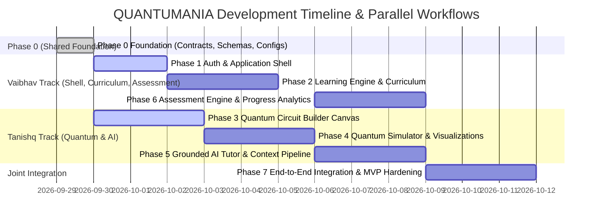

# Development Roadmap & Phase Dependencies

## 1. Roadmap Overview & Parallel Tracks

The development lifecycle for **QUANTUMANIA** is structured into 8 distinct phases (Phase 0 through Phase 7) distributed between **Vaibhav** and **Tanishq**.

Because Phase 0 establishes frozen contracts (`docs/QUANTUM_SCHEMA.md`, `docs/API_CONTRACT.md`, `docs/DATABASE.md`), **Vaibhav and Tanishq can work completely in parallel after Phase 0 without blocking each other**.

---

## 2. Phase Breakdown & Deliverables

### Phase 0 — Foundation & Shared Contracts
* **Owner**: Vaibhav
* **Status**: In Progress / Completion Stage
* **Key Deliverables**:
  - Modular project structure (`frontend/`, `backend/`, `docs/`, `.github/`).
  - Canonical Quantum Schema (`docs/QUANTUM_SCHEMA.md`).
  - Standardized REST API Contract (`docs/API_CONTRACT.md`).
  - Relational Database Design (`docs/DATABASE.md`).
  - Grounded AI Architecture (`docs/AI_ARCHITECTURE.md`).
  - UI System & Design Tokens (`docs/UI_SYSTEM.md`).
  - Team Governance and Git workflows (`docs/TEAM_OWNERSHIP.md`).

### Phase 1 — Authentication + Application Shell
* **Owner**: Vaibhav
* **Dependencies**: Phase 0
* **Key Deliverables**:
  - User registration, login, and JWT token issuance endpoints.
  - Frontend responsive application shell: Navbar, Sidebar navigation, User profile avatar.
  - Protected route guard middleware on client and server.

### Phase 2 — Learning + Curriculum Engine
* **Owner**: Vaibhav
* **Dependencies**: Phase 0, Phase 1
* **Key Deliverables**:
  - Course catalog and syllabus tree (`GET /courses`, `GET /courses/{id}`).
  - Lesson viewer with formatted Markdown and LaTeX mathematical notation.
  - Lesson progress tracking and completion toggles.
  - Embedded placeholder canvas container for Circuit Builder mounting.

### Phase 3 — Quantum Circuit Builder
* **Owner**: Tanishq
* **Dependencies**: Phase 0 (Consumes `docs/QUANTUM_SCHEMA.md`)
* **Key Deliverables**:
  - Interactive multi-qubit grid timeline (up to 10 qubits).
  - Gate palette with draggable $X, Y, Z, H, CNOT, MEASURE$ tiles.
  - Client-side validation preventing overlapping gates and identical control/target indices.
  - Serializer producing valid `CanonicalCircuit` JSON.

### Phase 4 — Quantum Simulator + Visualization
* **Owner**: Tanishq
* **Dependencies**: Phase 0, Phase 3
* **Key Deliverables**:
  - Deterministic Python statevector math simulator engine.
  - `POST /simulate` endpoint returning normalized `SimulationResult`.
  - Measurement shot sampling (e.g. 1024 shots).
  - Interactive histogram visualizer for bitstring measurement counts.
  - 3D/2D Bloch sphere visualizer for single-qubit states.

### Phase 5 — Grounded AI Tutor
* **Owner**: Tanishq
* **Dependencies**: Phase 0, Phase 4
* **Key Deliverables**:
  - Context builder assembling active lesson, circuit JSON, and verified simulation counts.
  - AI endpoints: `POST /ai/explain`, `POST /ai/debug`, `POST /ai/hint`, `POST /ai/generate-code`.
  - Frontend AI Tutor drawer dock with interactive Socratic dialogue.

### Phase 6 — Assessment + Progress Analytics
* **Owner**: Vaibhav
* **Dependencies**: Phase 0, Phase 2, Phase 4 (Evaluates circuits via Phase 4 simulator)
* **Key Deliverables**:
  - Quiz viewer and automated submission grader (`POST /quizzes/{id}/submit`).
  - Algorithmic challenge runner verifying student circuits against target criteria.
  - Progress dashboard: XP calculation, badge awards, streak tracking, and next topic recommendations.

### Phase 7 — Integration + MVP Hardening
* **Owner**: Vaibhav (with Tanishq peer review)
* **Dependencies**: All preceding phases (1 through 6)
* **Key Deliverables**:
  - End-to-end integration testing of complete user journey.
  - Performance profiling (ensuring sub-second simulation response times).
  - Cross-browser responsive testing.
  - Deployment configuration and final SIH demonstration rehearsal.

---

## 3. Dependency Graph & Parallel Decoupling

```mermaid
graph TD
    P0["Phase 0: Foundation (Shared Contracts)"]
    
    subgraph VaibhavTrack["Track V (Vaibhav)"]
        P1["Phase 1: Auth & Shell"]
        P2["Phase 2: Curriculum"]
        P6["Phase 6: Assessment & Progress"]
    end
    
    subgraph TanishqTrack["Track T (Tanishq)"]
        P3["Phase 3: Circuit Builder"]
        P4["Phase 4: Simulator & Visualizer"]
        P5["Phase 5: AI Tutor Engine"]
    end
    
    P7["Phase 7: System Integration & MVP Hardening"]

    P0 ==> P1
    P1 --> P2
    P2 --> P6

    P0 ==> P3
    P3 --> P4
    P4 --> P5

    P4 -.->|"Simulator reused for grading"| P6
    P6 --> P7
    P5 --> P7
```

> **Decoupling Strategy**:
> Tanishq can develop the Circuit Builder and Simulator using mock lesson containers, while Vaibhav develops Curriculum and Assessment using mock circuit payloads defined in `docs/QUANTUM_SCHEMA.md`. Neither developer is blocked.
