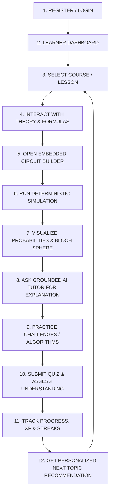

# Product Requirements Document (PRD)

## 1. Executive Summary & Vision

* **Project Title**: AI-Based Interactive Quantum Algorithm Learning Platform (**QUANTUMANIA**)
* **Initiative**: Smart India Hackathon (SIH 2026)
* **Target Audience**: Undergraduate engineering students, introductory quantum computing enthusiasts, self-learners, and educators.
* **Core Problem**: Quantum computing has a steep learning curve due to complex mathematical abstraction (linear algebra, Hilbert spaces) and a disconnect between mathematical theory and actual quantum circuit implementation. Existing frameworks (Qiskit, Cirq) are script-heavy, while generic LLMs hallucinate quantum states without mathematical grounding.
* **Solution**: An interactive web platform combining an intuitive drag-and-drop circuit canvas, a verified local statevector simulator, 2D/3D visualizations (Bloch sphere, histograms), a grounded Socratic AI tutor, and gamified progressive challenges.

---

## 2. Complete MVP User Journey

---

## 3. Detailed MVP Feature Specifications

### 3.1. Authentication & Learner Profile (Phase 1)
- User registration and login via email/password.
- Secure session tokens (JWT) with persistent login state.
- Learner profile tracking experience level (`beginner`, `intermediate`, `advanced`), total XP points, and active learning streaks.

### 3.2. Structured Curriculum & Interactive Lessons (Phase 2)
- Structured courses divided into progressive modules and discrete lessons.
- Lesson viewer with formatted Markdown, mathematical formulas (LaTeX), and pre-populated interactive circuit sandboxes.
- Ability to mark lessons as completed and seamlessly navigate to the next topic.

### 3.3. Quantum Circuit Builder (Phase 3)
- Visual multi-qubit grid timeline (up to 10 qubits for MVP).
- Gate palette containing fundamental quantum operators:
  - Single-qubit gates: $X, Y, Z, H$
  - Two-qubit entangling gates: $CNOT$ (with visual control dot and target crosshair)
  - Measurement blocks: Mapping quantum wires to classical register bits.
- Drag-and-drop or click-to-place gate manipulation.
- Canonical JSON export/import conforming to `docs/QUANTUM_SCHEMA.md`.

### 3.4. Quantum Simulator & Visualizations (Phase 4)
- Fast local deterministic statevector simulator supporting pure states.
- Configurable measurement shots (default: 1024).
- Interactive Visualizations:
  - **Measurement Histogram**: Frequency distribution across measured basis bitstrings ($|00\rangle, |11\rangle$).
  - **Statevector Amplitude Table**: Real, imaginary, phase angle, and magnitude probabilities.
  - **Bloch Sphere Coordinates**: Single-qubit state vectors rendered on 3D or 2D sphere projections.

### 3.5. Grounded AI Quantum Tutor (Phase 5)
- Context-aware chat drawer anchored to the active lesson and current circuit canvas.
- Socratic explanations of observed quantum behaviors (e.g. quantum superposition, phase cancellation, entanglement).
- Strict non-hallucination constraint: all explanations are grounded in verified simulation outputs.
- Step-by-step hint generation for algorithmic challenges.
- Code translation into standard Python Qiskit scripts.

### 3.6. Assessment, Challenges & Analytics (Phase 6)
- Lesson knowledge check quizzes (multiple choice with instant automated scoring).
- Algorithmic circuit challenges (e.g. Bell State preparation, Superdense Coding, Deutsch Algorithm check).
- Automated challenge grading comparing circuit statevectors with target criteria within numerical tolerance ($\epsilon \le 10^{-4}$).
- Comprehensive student analytics dashboard displaying course progress percentages, XP breakdown, and personalized next-step recommendations.

---

## 4. MVP Success Metrics

1. **Circuit Simulation Latency**: $< 200\text{ ms}$ for circuits up to 5 qubits.
2. **AI Tutor Context Accuracy**: 100% of mathematical statements match simulator output without numerical hallucination.
3. **Usability**: First-time users can build and simulate a Bell State $|\Phi^+\rangle$ in under 2 minutes.
4. **Reliability**: Zero cross-developer git merge conflicts due to strict Phase 0 contract boundaries.
