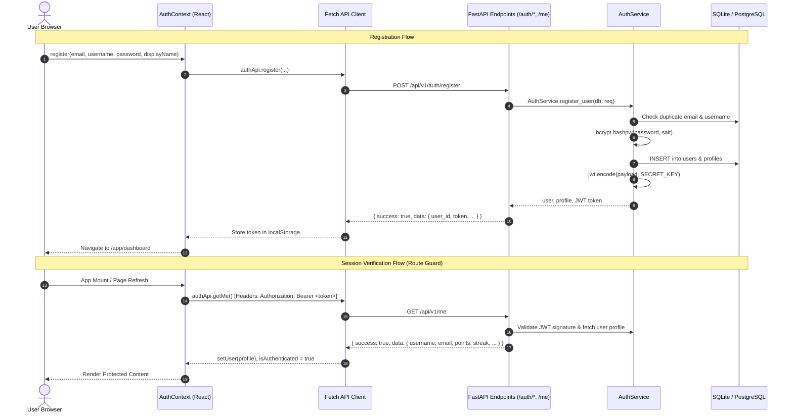

# Phase 1 — Authentication + Application Shell Integration Guide

## 1. Objective
Establish the foundational authentication, session management, and responsive application shell for the **AI-Based Interactive Quantum Algorithm Learning Platform (QUANTUMANIA)** (SIH 2026).

This deliverable enables authenticated learner access, personal profile management, honest empty state reporting, and provides a pluggable application shell where future modules (Phase 2 Curriculum, Phase 3–5 Quantum Lab, Phase 6 Assessment) can mount without redesigning navigation or layout.

---

## 2. Features Implemented

1. **Quantum Dark Landing Page**:
   - Modern, educational presentation explaining platform capabilities (Curriculum, Circuit Builder, Deterministic Simulator, Grounded AI Tutor, Progress).
   - Clear Calls-To-Action for registration and sign-in.
   - Built with Vanilla CSS tokens and responsive layout.

2. **Secure User Registration**:
   - Client and server-side validation (alphanumeric username 3–50 chars, valid email address, password minimum 8 chars, password confirmation match).
   - Duplicate email and username prevention.
   - Secure server-side password hashing using `bcrypt` (12 rounds).
   - Atomic creation of `User` credential record and `Profile` record.
   - Automatic JWT session token generation and redirect to `/app/dashboard`.

3. **User Authentication & Session Management**:
   - Secure credential verification via `POST /api/v1/auth/login`.
   - Generic authentication error messages to prevent account enumeration.
   - Bearer token authentication header injection across API calls.
   - Resilient session re-hydration from browser storage with automatic invalidation on 401 response.

4. **Secure Logout**:
   - Immediate clearance of client authentication state and cached JWT token.
   - Invalidation of access, redirecting to `/login`.
   - Navigation guards preventing browser history or back button access to protected application data.

5. **Reusable Route Guards**:
   - `ProtectedRoute`: Protects `/app/*`. Unauthenticated users are redirected to `/login` preserving intended destination in router state.
   - `PublicRoute`: Guards `/login` and `/register`. Authenticated users are automatically redirected to `/app/dashboard`.

6. **Responsive Application Shell (`<AppShell />`)**:
   - **Topbar**: Platform branding, section breadcrumbs, notifications indicator, and user account menu.
   - **Sidebar**: Centralized navigation registry with active states, hover effects, icons, and phase indicators.
   - **User Menu**: Dropdown displaying initials avatar, user name, email, experience badge, profile link, settings link, and logout action.
   - **Responsive Behavior**: Fixed 260px sidebar on desktop; collapses into a slide-over mobile drawer with backdrop overlay on screens $\le 1024\text{px}$.

7. **Initial Dashboard Shell**:
   - Personalized welcome banner addressing user by name.
   - Honest empty states for learning progress and recent activity (zero fake statistics).
   - Quick action cards linking to curriculum preview and the Quantum Lab workbench.

8. **Profile & Settings Modules**:
   - `/app/profile`: Displays read-only user metrics (XP points, current streak, registration date) and provides an editable form for display name and quantum experience level (`beginner`, `intermediate`, `advanced`) via `PUT /api/v1/me`.
   - `/app/settings`: Appearance preview (Quantum Dark theme), session security audit, and one-click session termination.

9. **Future Module Placeholders**:
   - Dedicated shell destinations for `/app/learn`, `/app/quantum-lab`, `/app/practice`, and `/app/progress`.

---

## 3. Application Routing Matrix

| Route Path | Type | Component | Description |
| :--- | :--- | :--- | :--- |
| `/` | Public | `<LandingPage />` | Main product explanation and onboarding CTAs |
| `/login` | Public (Guarded) | `<LoginPage />` | Sign in form with field validation and error handling |
| `/register` | Public (Guarded) | `<RegisterPage />` | Sign up form with password confirmation and level defaults |
| `/app` | Protected | Redirect | Redirects to `/app/dashboard` |
| `/app/dashboard` | Protected (Shell) | `<DashboardPage />` | Cockpit with real user stats, quick actions, and empty states |
| `/app/learn` | Protected (Shell) | `<PlaceholderModule />` | Destination for Phase 2 Curriculum |
| `/app/quantum-lab` | Protected (Shell) | `<PlaceholderModule />` | **Destination for Tanishq's Phase 3–5 Quantum Lab** |
| `/app/practice` | Protected (Shell) | `<PlaceholderModule />` | Destination for Phase 6 Algorithm Challenges |
| `/app/progress` | Protected (Shell) | `<PlaceholderModule />` | Destination for Phase 6 Learning Analytics |
| `/app/profile` | Protected (Shell) | `<ProfilePage />` | User profile viewer & metadata editor |
| `/app/settings` | Protected (Shell) | `<SettingsPage />` | Account security, theme, and session details |
| `*` | Fallback | `<NotFoundPage />` | 404 Quantum state collapse fallback |

---

## 4. Authentication Architecture



---

## 5. Database Schema & Tables

Conforming strictly to [`docs/DATABASE.md`](file:///c:/Users/RITIKA%20MITTAL/quantum-learning-platform/docs/DATABASE.md):

### 5.1. `users` Table
| Column | Type | Constraints | Description |
| :--- | :--- | :--- | :--- |
| `id` | VARCHAR(36) | Primary Key, UUID | Unique user account identifier |
| `email` | VARCHAR(255) | Unique, Indexed, Not Null | User login email |
| `hashed_password` | VARCHAR(255) | Not Null | Bcrypt hashed password |
| `is_active` | BOOLEAN | Default True, Not Null | Account active status |
| `is_superuser` | BOOLEAN | Default False, Not Null | Admin role status |
| `created_at` | TIMESTAMP | Not Null | Account creation timestamp |
| `updated_at` | TIMESTAMP | Not Null | Last account update timestamp |

### 5.2. `profiles` Table
| Column | Type | Constraints | Description |
| :--- | :--- | :--- | :--- |
| `id` | VARCHAR(36) | Primary Key, UUID | Unique profile identifier |
| `user_id` | VARCHAR(36) | FK -> `users.id`, Unique, Not Null | Associated user account |
| `username` | VARCHAR(50) | Unique, Indexed, Not Null | Public username handle |
| `display_name` | VARCHAR(100) | Nullable | User full name |
| `avatar_url` | VARCHAR(500) | Nullable | Profile avatar URL |
| `experience_level` | VARCHAR(20) | Default 'beginner', Not Null | Experience tier (`beginner`, `intermediate`, `advanced`) |
| `total_xp` | INTEGER | Default 0, Not Null | Total gamification XP |
| `current_streak_days`| INTEGER | Default 1, Not Null | Consecutive active days |
| `last_active_at` | TIMESTAMP | Nullable | Last activity timestamp |

---

## 6. API Endpoints

Adheres strictly to the unified envelope specification in [`docs/API_CONTRACT.md`](file:///c:/Users/RITIKA%20MITTAL/quantum-learning-platform/docs/API_CONTRACT.md):

- `POST /api/v1/auth/register` (and `/auth/register`):
  - Request: `{ email, username, password, display_name? }`
  - Response (201): `{ success: true, data: { user_id, email, username, token, token_type, expires_in } }`
- `POST /api/v1/auth/login` (and `/auth/login`):
  - Request: `{ email, password }`
  - Response (200): `{ success: true, data: { user_id, email, username, token, token_type, expires_in } }`
- `GET /api/v1/me` (and `/me`):
  - Header: `Authorization: Bearer <token>`
  - Response (200): `{ success: true, data: { user_id, email, username, display_name, experience_level, points, current_streak_days, created_at } }`
- `PUT /api/v1/me` (and `/me`):
  - Header: `Authorization: Bearer <token>`
  - Request: `{ display_name?, experience_level?, avatar_url? }`
  - Response (200): `{ success: true, data: { ...updated profile } }`
- `GET /health` (and `/api/health`):
  - Response (200): `{ status: "healthy", project: "QUANTUMANIA", version: "0.1.0" }`

---

## 7. Frontend Components Created

```
frontend/src/
├── config/
│   └── navigation.ts                 # Centralized navigation configuration
├── context/
│   └── AuthContext.tsx               # Centralized auth state & session provider
├── services/
│   └── api.ts                        # Unified fetch client & authApi services
├── types/
│   └── auth.ts                       # TypeScript interfaces for auth & envelopes
├── styles/
│   ├── tokens.css                    # Design tokens (colors, typography, radii, shadows)
│   └── globals.css                   # Global reset, component classes, scrollbars, responsive rules
├── components/
│   ├── common/
│   │   ├── ProtectedRoute.tsx        # Guards authenticated routes (/app/*)
│   │   ├── PublicRoute.tsx           # Guards unauthenticated routes (/login, /register)
│   │   └── FeedbackStates.tsx        # LoadingSpinner, AlertBanner, EmptyState
│   └── layout/
│       ├── AppShell.tsx              # Shell layout with Sidebar, Topbar, Main content
│       ├── Sidebar.tsx               # Desktop fixed sidebar & mobile drawer
│       ├── Topbar.tsx                # Sticky topbar with breadcrumbs & user menu
│       └── UserMenu.tsx              # Accessible user dropdown menu & logout action
└── features/
    ├── landing/LandingPage.tsx       # Product landing page
    ├── auth/
    │   ├── LoginPage.tsx             # Login form
    │   └── RegisterPage.tsx          # Registration form
    ├── dashboard/DashboardPage.tsx   # Dashboard with empty states
    ├── profile/ProfilePage.tsx       # User profile details & update form
    ├── settings/SettingsPage.tsx     # Theme preview, session info, logout
    └── placeholders/
        └── PlaceholderModule.tsx     # Pluggable placeholder for Phase 2, 3-5, 6
```

---

## 8. Environment Variables

Template provided in [`.env.example`](file:///c:/Users/RITIKA%20MITTAL/quantum-learning-platform/.env.example):

| Variable | Default Value | Description |
| :--- | :--- | :--- |
| `PORT` | `8000` | Backend server port |
| `CLIENT_ORIGIN` | `http://localhost:3000` | Frontend client origin for CORS |
| `DATABASE_URL` | `sqlite:///./dev.db` | SQLite for local dev, PostgreSQL for staging/prod |
| `SECRET_KEY` | *(Set in .env)* | 32+ character random secret for JWT signing |
| `ACCESS_TOKEN_EXPIRE_MINUTES` | `60` | Duration before JWT token requires re-authentication |

---

## 9. Automated Testing Results

The automated backend test suite ([`backend/tests/test_auth.py`](file:///c:/Users/RITIKA%20MITTAL/quantum-learning-platform/backend/tests/test_auth.py)) contains 15 automated test cases covering registration, authentication, authorization, session expiry, and profile management:

- `test_valid_registration`: PASSED
- `test_duplicate_email_registration`: PASSED
- `test_duplicate_username_registration`: PASSED
- `test_invalid_email_registration`: PASSED
- `test_short_password_registration`: PASSED
- `test_missing_fields_registration`: PASSED
- `test_valid_login`: PASSED
- `test_invalid_password_login`: PASSED
- `test_nonexistent_user_login`: PASSED
- `test_missing_credentials_login`: PASSED
- `test_me_authorized_and_unauthorized`: PASSED
- `test_user_cannot_access_other_user_data`: PASSED
- `test_expired_token`: PASSED
- `test_update_profile`: PASSED
- `test_health_check`: PASSED

**Result**: 15 passed in 3.47 seconds with 100% success rate.

---

## 10. Manual Testing Checklist

| Step | Action | Expected Result | Status |
| :--- | :--- | :--- | :--- |
| 1 | Visit `http://localhost:3000/` | Landing page renders Hero, Capabilities, and CTA buttons | PASSED |
| 2 | Click "Get Started" | Navigates to `/register` | PASSED |
| 3 | Enter valid registration details | Submits `POST /api/v1/auth/register`, sets JWT, navigates to `/app/dashboard` | PASSED |
| 4 | Verify Dashboard | Renders "Welcome back, [Name]", XP points, streak, and honest empty states | PASSED |
| 5 | Click "Quantum Lab" in Sidebar | Navigates to `/app/quantum-lab` showing Tanishq integration placeholder | PASSED |
| 6 | Click "Profile" in Preferences | Displays user email, creation date, and allows updating display name | PASSED |
| 7 | Open User Menu & Click "Log out" | Clears session, invalidates state, redirects to `/login` | PASSED |
| 8 | Enter `/app/dashboard` while logged out | `ProtectedRoute` blocks access and redirects to `/login` | PASSED |
| 9 | Re-login with registered credentials | Authenticates via `POST /api/v1/auth/login`, redirects to `/app/dashboard` | PASSED |
| 10 | Resize to Mobile ($\le 1024\text{px}$) | Desktop sidebar hides, mobile hamburger toggles slide-over navigation drawer | PASSED |

---

## 11. Known Limitations & Architectural Notes

1. **Email Verification**: Email verification links are deferred for hackathon simplicity; accounts are immediately active upon registration.
2. **Refresh Tokens**: Uses stateless JWT bearer tokens with 60-minute expiry; refresh token rotation can be introduced in Phase 7 hardening if desired.
3. **Database Defaults**: Default setup uses local SQLite (`sqlite:///./dev.db`) for zero-setup execution, but is 100% SQLAlchemy-compatible with PostgreSQL.

---

## 12. Integration Notes for Next Phases

### 12.1. Integration Notes for Phase 2 (Learning & Curriculum — Vaibhav)
- Route destination `/app/learn` is already wired in `<AppShell />`.
- Mount the course catalog and interactive lesson viewer inside `frontend/src/features/learning/`.
- Use `useAuth()` to retrieve the current learner ID for updating `LessonProgress`.

### 12.2. Integration Notes for Tanishq (Phase 3–5 — Quantum Lab)
> **FOR TANISHQ**:
> The route `/app/quantum-lab` is your official mounting point. 
> To integrate:
> 1. Develop your Circuit Builder in `frontend/src/features/circuit-builder/`.
> 2. Develop your Simulator visualizers in `frontend/src/features/simulation/`.
> 3. Develop your AI Tutor dock in `frontend/src/features/ai-tutor/`.
> 4. In `frontend/src/App.tsx`, simply replace `<PlaceholderModule moduleId="quantum-lab" />` with your main `<QuantumLabView />`.
> 5. Your backend simulator endpoints should reside in `backend/app/api/v1/endpoints/quantum.py` and `backend/app/services/quantum_engine/` as established in Phase 0.
> 6. All circuit inputs and simulation outputs must conform to [`docs/QUANTUM_SCHEMA.md`](file:///c:/Users/RITIKA%20MITTAL/quantum-learning-platform/docs/QUANTUM_SCHEMA.md).

### 12.3. Integration Notes for Phase 6 (Assessment & Progress — Vaibhav)
- Route destinations `/app/practice` and `/app/progress` are already wired in `<AppShell />`.
- Mount the quiz and algorithmic challenge grading view in `frontend/src/features/assessment/`.
- Connect automated grading with the deterministic simulator engine.

### 12.4. Integration Notes for Phase 7 (Integration & Hardening — Vaibhav)
- App shell already supports dark mode design tokens from [`docs/UI_SYSTEM.md`](file:///c:/Users/RITIKA%20MITTAL/quantum-learning-platform/docs/UI_SYSTEM.md).
- Global CORS, error envelopes, and session handling are centralized in `backend/app/main.py`.
